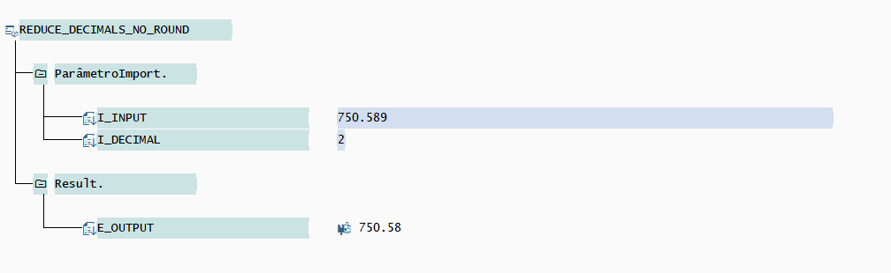
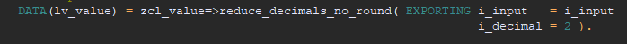
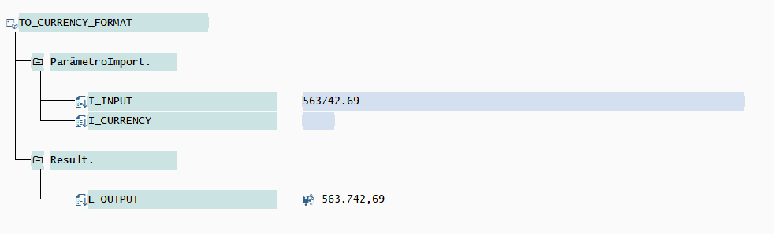
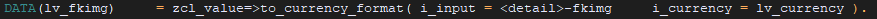

# Classe com utilitários para valores
 
## Método REDUCE_DECIMALS_NO_ROUND
Reduz casas decimais de um campo sem arredondamento

Passar o valor atual do campo e informar o tamanho de casas decimais desejadas

### Exemplo de uso

## Método TO_CURRENCY_FORMAT
Retorna o valor no formato da moeda. Obs: não executa conversão de moeda, somente retorna o valor no formato.  

Informar o valor e o formato da moeda(BRL).

### Exemplo de uso

 
